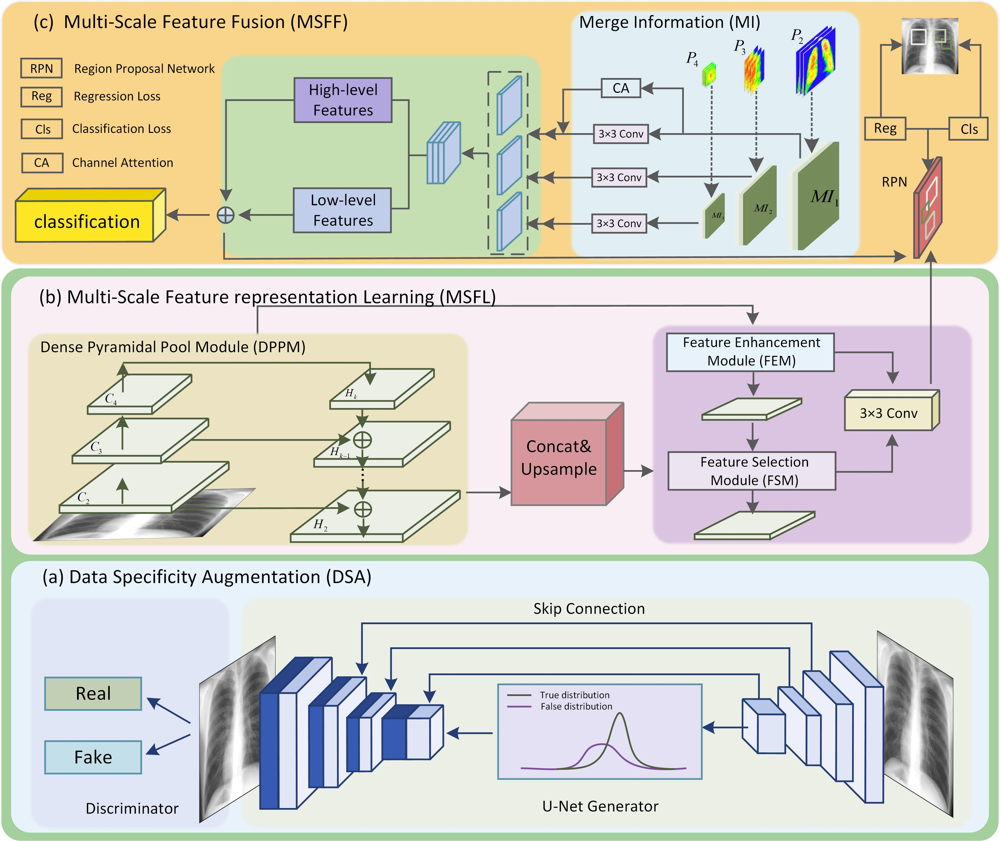

# OMSF2 model from Pytorch
## Code for the paper:"OMSF2: Optimizing Multi-Scale Feature Fusion Learning for Pneumoconiosis Staging Diagnosis through Data Specificity Augmentation"
## Model Overview
We propose an optimized multi-scale feature fusion learning framework named OMSF2, which consists of three main modules: the data-specific enhancement module for automatically capturing diverse information in pneumoconiosis images, the multi-scale feature learning module for extracting multi-directional features of tiny targets using refined micro-feature localization and dense pooling networks, and the multi-scale feature fusion module for obtaining a broader context of global information by fusing high-level and low-level features to better understand subtle differences between different disease stages. This method innovatively addresses the problem of maintaining cross-layer gradient consistency and provides a new, efficient learning framework for pneumoconiosis image processing. The architecture of OMSF2 is illustrated below:

## Pneumoconiosis Dataset
The pneumoconiosis dataset will be made accessible for research endeavors upon formal application.

## Downloading the Dataset (v1.0)
Download link of labeled CheXpert dataset is available at
https://stanfordaimi.azurewebsites.net/datasets/8cbd9ed4-2eb9-4565-affc-111cf4f7ebe2
The test set image link is available at
https://stanfordaimi.azurewebsites.net/datasets/23c56a0d-15de-405b-87c8-99c30138950c

## Acknowledgments
This research is supported by National Natural Science Foundation of China[grant numbers  62376183]; National Natural Science Foundation of China[grant numbers U21A20469]; National Natural Science Foundation of China[grant numbers 61972274]; National Health Commission Key Laboratory of Pneumoconiosis open project[grant numbers YKFKT004]; NHC Key Laboratory of Pneumoconiosis Shanxi China [grant numbers 2020-PT320-005]; Shanxi Provincial Science and Technology Innovation Talent Team Special Plan [grant numbers 202304051001009]; China Scholarship Council [grant numbers 202306930020].